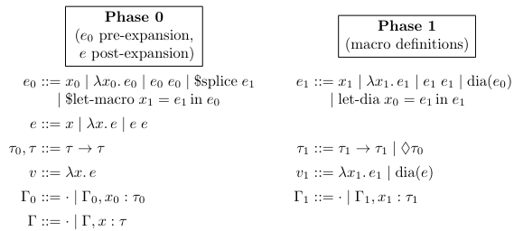
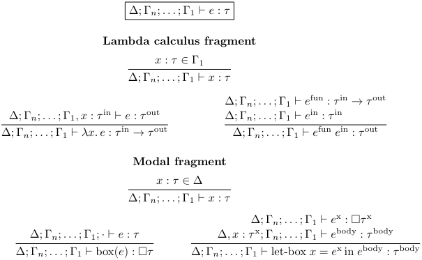

# Staged Diamond Calculus

A variant of Pfenning and Davies's Staged Modal Calculus with Diamond instead of Box.

*   "Staged" means that we can write stage-1 code to assemble stage-0 code from
    smaller parts.
*   "Modal" means that at the type-level, we use a modal operator to distinguish
    between a value of type Int and the code of a stage-0 expression which
    produces a value of type Int.
*   The "Box" modality means that something is "true in all possible worlds". In
    the case of Pfenning and Davies's calculus, a value of type `Box Int` is the
    code of a stage-0 expression which can successfully be spliced anywhere,
    regardless of which variables are in scope at that point, in "every possible
    context". This is accomplished by making sure that the stage-0 expression is
    closed, that is, it does not refer to any variable it doesn't define itself.
*   The "Diamond" modality means that something is "true in some world". In the
    case of Pfenning and Davies's calculus, a value of type Diamond Int is the
    code of a stage-0 expression which can successfully be spliced in one
    specific context, namely, the one into which the stage-0 expression which is
    currently being assembled will eventually be spliced.

## Examples

Here is a example program.
```
(define (cube0 x0)
  ($let-macro [(power1 n1)
               (case n1
                 [0
                  (dia 1)]
                 [1
                  (dia x0)]
                 [_
                  (let-dia [recur0 (power1 (- n1 1))]
                    (dia (* x0 recur0)))])]
    ($splice (power1 3))))
```

The variables
```
cube0 :: Int -> Int
x0 :: Int
recur0 :: Int
```
all live in stage 0, while the variables
```
power1 :: Int -> Dia Int
n1 :: Int
```
live in stage 1. The stage-1 expression `(power1 3)` assembles the stage-0 code
`(* x0 (* x0 x0))` (note the absence of administrative redexes), and `$splice`
inserts that code where `$splice` is called, thus resulting in the following
fully-expanded program. By convention, the 0 suffixes are dropped once expansion
is complete.
```
(define (cube x)
  (* x (* x x)))
```

Note how `(dia x0)` and `(dia (* x0 recur0))` refer to the variable `x0`,
something which is not possible with `box`. This extra expressiveness comes with
an extra obligation: we must ensure that this stage-0 code is only ever spliced
in a context where `x0` is in scope. The calculus is carefully designed to
guarantee this.

In this case, the `x0` variable is in scope in the `dia` code fragments because
they are within a `$let-macro` expression which is itself in a context where
`x0` is in scope. The code fragments can be moved around and assembled into
larger code fragments, but only within the `$let-macro`; there are no mutable
variables or exceptions which would allow the code fragments to be smuggled to
another part of the phase-1 code, outside the scope where `x0` is bound. The
only thing which can be done with those code fragments is to `$splice` them
within the body of the `$let-macro`, where it is safe to do so because `x0` is
in scope.

Here is a slight variant of the above example.
```
($let-macro [(power1 n1 x1)
             (case n1
               [0
                (dia 1)]
               [1
                x1]
               [_
                (let-dia [recur0 (power1 (- n1 1) x1)]
                  (let-dia [x0 x1])
                    (dia (* x0 recur0)))])]
  (define (square0 x0)
    ($splice (power1 2 (dia x0))))
  (define (cube0 x0)
    ($splice (power1 3 (dia x0)))))
```

This time, thanks to its `x1 :: Dia Int` argument, `power1` receives a code
fragment which refers to a variable `x0` which is _not_ in scope around the
`$let-macro`. This is still safe because `power1` still cannot smuggle the code
fragment anywhere, it can only return a code fragment which refers to `x0` to
its call site, and this is fine since the variable `x0` is in scope at that call
site. This time, it is `$splice` which acts as a boundary ensuring that
`(dia x0)` cannot be spliced somewhere in which `x0` is not in scope.

[Here is what this example actually looks like](https://github.com/gelisam/staged-diamond-type-theory/blob/6772937056cd78966a8ebaedb6c41cd544273aed/src/toy.rkt#L1148-L1167) in the implementation.

## Syntax



## Typing Rules


## Big-Steps Operational Semantics


## Comparison with Pfenning and Davies

The Staged Diamond Calculus and Pfenning and Davies's Staged Box Calculus both
use two contexts, but those contexts have very different meanings. The Staged
Diamond Calculus only supports two stages: `Dia Int` is a phase-1 type, but
`Dia (Dia Int)` would be a phase-2 type and the calculus does not have a stage
2. By contrast, `Box (Box Int)` is a valid type in the Staged Box Calculus,
which supports an unbounded number of stages despite only using two contexts. To
make it easier to compare the two calculi, here is a reformulation of the Staged
Box Calculus which uses an unbounded number of contexts. Those extra contexts
are purely decorative, they do not affect the semantics of the calculus, as only
the leftmost and the rightmost contexts are accessible.



Specializing those rules to the `n = 1` case, we can finally compare the Staged
Box Calculus and the Staged Diamond Calculus on an equal footing.


We can now see that both introduction rules type-check a term in a different
context, but that Box uses a new empty context while Diamond reuses an existing
context which might already contain some variables.

As a result, the eliminator for Box can add `x` to the special Delta context
whose variables can be accessed from everywhere, while Diamond must add `x` to
the one context where the code fragment makes sense.

## Open Questions

Does the Staged Diamond Calculus already exist in the litterature under a
different name?

How to extend the Staged Diamond Calculus to an unbounded number of contexts?

Is there an equivalent to `$splice` which makes sense in the Staged Box
Calculus, and similarly for `$let-macro`?

How to define a contextual version of the Diamond modality?

How to split the Diamond modality into two half-modalities, in the style of
Adjoint Calculus?

Can we combine Box and Diamond in a single calculus, and if so, does the result
correspond to any specific flavor of Modal Logic?
